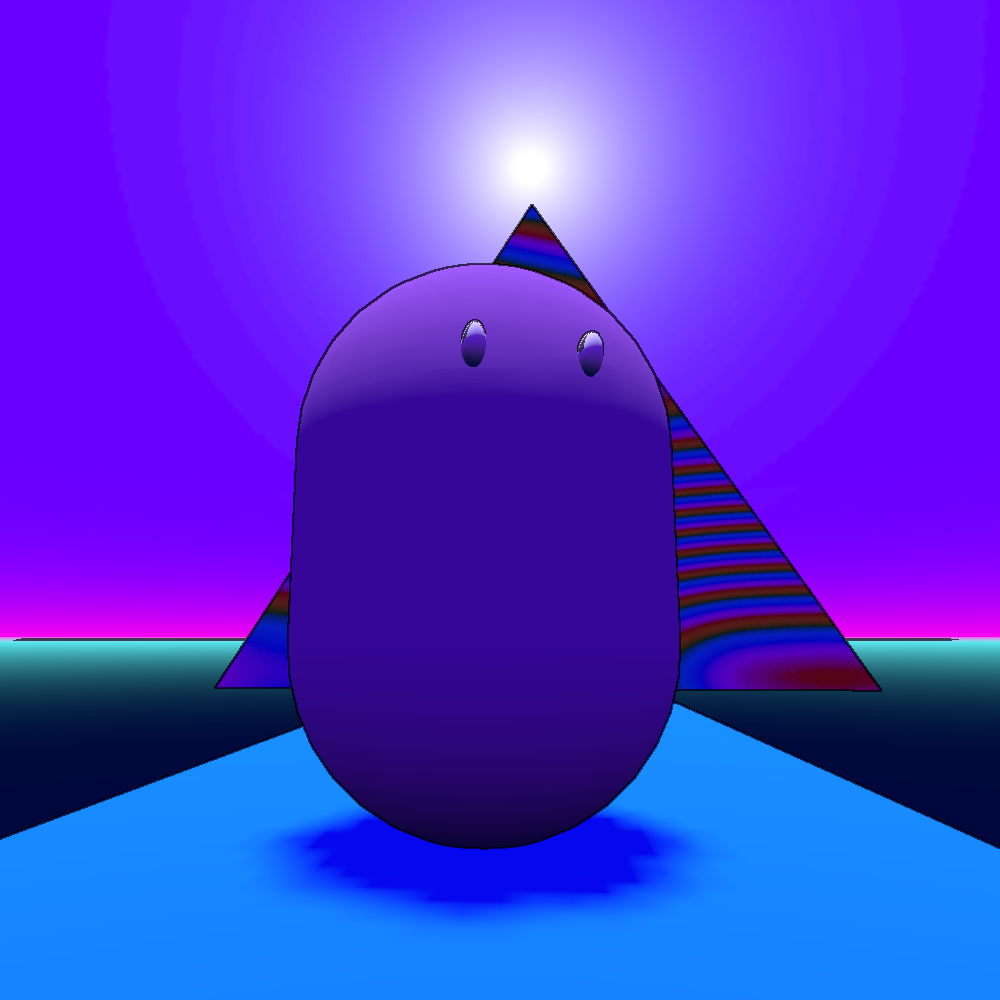

#   BreezyWave

Currently protype game made on [Godot Engine](https://github.com/godotengine/godot), template from [godot-game-template](https://github.com/crystal-bit/godot-game-template#change-scene-and-show-progress-bar). 

## FAQ

#### **Where are the settings stored?**

* Windows: `%APPDATA%/Godot/app_userdata/BreezyWave/settings.cfg`
* Linux: `~/.local/share/godot/app_userdata/BreezyWave/settings.cfg`
* Mac: `~/Library/Application Support/Godot/app_userdata/BreezyWave/settings.cfg`